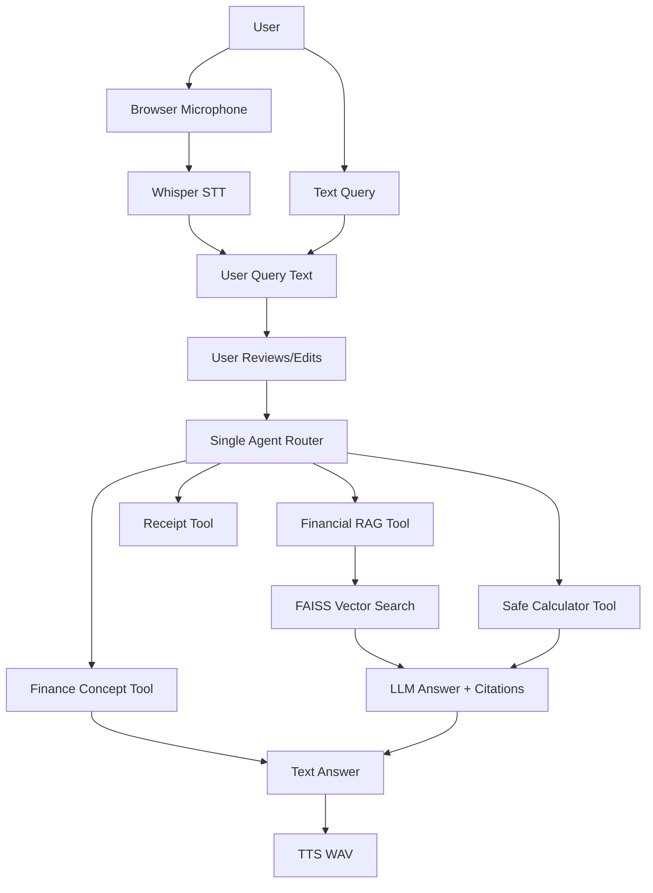

# FinSight Voice

FinSight Voice is a small, locally runnable portfolio project: a voice-enabled financial research and expense assistant built with FastAPI, Streamlit, RAG, an agent router, Whisper STT, TTS, and optional receipt analysis.

It is intentionally an interview prototype, not an enterprise system or professional financial advisor.

## Problem Statement

Financial filings are long, dense, and hard to query quickly. This project demonstrates how a compact AI assistant can retrieve evidence from a tiny curated set of SEC filings, answer with citations, use deterministic arithmetic when needed, accept voice input, speak answers aloud, and optionally parse receipt images.

## Why Finance?

Finance is a good portfolio domain because it needs factual grounding, numeric accuracy, citations, and clear failure handling. Those requirements make RAG, tools, and evaluation meaningful rather than decorative.

## Features

- FastAPI backend with Pydantic validation.
- Streamlit demo UI with browser microphone capture, editable transcription, and optional answer playback.
- Small SEC 10-K corpus for Apple, Microsoft, and Tesla.
- PyMuPDF PDF extraction, metadata-aware chunking, Sentence Transformer embeddings, and FAISS search.
- One simple agent router with financial search, calculator, receipt analysis, and finance concept tools.
- Citation-aware RAG answer generation.
- Whisper speech-to-text and local TTS.
- Optional receipt workflow: YOLO/localization, OpenCV preprocessing, OCR, structured expense parsing.
- Small pytest and evaluation scripts.

## Architecture



## Data Flow

Financial PDFs are added locally under `data/raw`, extracted page by page, cleaned, chunked with metadata, embedded with `sentence-transformers/all-MiniLM-L6-v2`, and indexed in FAISS. User questions are routed by the agent to the right tool. RAG answers include citations from retrieved chunk metadata.

## Tech Stack

- Python 3.12: main language.
- FastAPI: backend API.
- Streamlit: simple demo frontend.
- PyMuPDF: PDF text extraction.
- Sentence Transformers: text embeddings.
- FAISS: local vector search.
- LLM API: answer generation over retrieved evidence.
- Whisper: speech to text.
- pyttsx3: lightweight local TTS.
- YOLO: optional receipt/document localization.
- OpenCV: deterministic image preprocessing.
- Tesseract OCR via `pytesseract`: image text extraction.

## Dataset And Sources

The corpus is intentionally small because this project is designed as an interview/portfolio prototype. The architecture can later scale to thousands of filings.

Initial target corpus:

- Apple 2023 and 2024 10-K
- Microsoft 2023 and 2024 10-K
- Tesla 2023 and 2024 10-K

For a larger demo corpus without Samsung, use 40 annual SEC filings:

- 10 Apple annual 10-K filings
- 10 Microsoft annual 10-K filings
- 10 Tesla annual 10-K filings
- 10 Google/Alphabet annual 10-K filings

The project does not commit full filings, vector indexes, or downloaded reports. SEC primary filings are usually HTML, not PDF. They are still official SEC filings and work well for chunking and citations.

Download the 40 SEC filings automatically:

```powershell
python scripts/download_sec_filings.py
```

This discovers recent `10-K` filings from the SEC submissions API and creates:

```text
data/raw/apple/*.html
data/raw/microsoft/*.html
data/raw/tesla/*.html
data/raw/google/*.html
data/processed/document_manifest.json
```

The final corpus should look like:

```text
data/raw/apple/2024_10k.html
data/raw/microsoft/2024_10k.html
data/raw/tesla/2024_10k.html
data/raw/google/2024_10k.html
```

If you prefer company annual report PDFs, place them at:

```text
data/raw/apple/2024_10k.pdf
data/raw/apple/2023_10k.pdf
data/raw/microsoft/2024_10k.pdf
data/raw/microsoft/2023_10k.pdf
data/raw/tesla/2024_10k.pdf
data/raw/tesla/2023_10k.pdf
```

If you download SEC documents programmatically, use a descriptive `SEC_USER_AGENT`.

## RAG Pipeline

```text
PDFs -> PyMuPDF pages -> cleaning -> overlapping chunks -> metadata -> embeddings -> FAISS -> top-k retrieval -> LLM -> answer + citations
```

Chunk size defaults to about 900 characters with 120 characters overlap. That is small enough for focused retrieval and simple enough to explain in an interview.

## Agent Architecture

RAG chain:

```text
Query -> Retriever -> Context -> LLM
```

Agent:

```text
Query -> decide required tool -> execute tool -> optionally note calculation -> final response
```

The agent is useful because not every request requires document retrieval. “What is free cash flow?” uses a concept tool, while “What was Apple’s revenue?” uses RAG.

## STT, TTS, And Receipt Pipelines

Whisper converts browser microphone recordings into query text. The transcription is shown in the UI first, so the user can review or edit it before sending it to RAG. Pretrained Whisper is used because the project needs speech recognition, not custom speech model training.

TTS uses `pyttsx3` to create a local WAV file from the exact displayed answer. TTS is optional; the answer always appears as readable text first.

Receipt analysis runs only when an image is uploaded:

```text
Receipt image -> YOLO/localization attempt -> OpenCV preprocessing -> OCR -> structured expense
```

YOLO is used for receipt localization, not OCR. OpenCV is used for deterministic preprocessing after detection and before OCR. OCR is necessary because YOLO identifies where the receipt is, while OCR converts visual text into machine-readable text.

## Installation

Windows PowerShell:

```powershell
python -m venv .venv
.\.venv\Scripts\Activate.ps1
python -m pip install --upgrade pip
pip install -r requirements.txt
copy .env.example .env
```

Windows CMD:

```cmd
python -m venv .venv
.venv\Scripts\activate.bat
python -m pip install --upgrade pip
pip install -r requirements.txt
copy .env.example .env
```

Set `API_KEY` in `.env` only if you want LLM-generated prose. Without it, the app returns a safe extractive fallback.

## Running

Ingest local PDFs:

```powershell
python scripts/ingest.py
```

Run backend:

```powershell
uvicorn app.main:app --reload
```

Run Streamlit:

```powershell
streamlit run frontend/streamlit_app.py
```

## Microphone Voice Workflow

The Streamlit UI uses the browser microphone:

```text
Click microphone -> speak -> Whisper STT -> editable transcription -> Send to Search -> agent/RAG -> text answer -> optional Speak Answer
```

The transcription is never sent automatically to RAG. You must click `Send to Search` after reviewing or editing the text.

## API

- `GET /health`
- `POST /api/chat`
- `POST /api/search`
- `POST /api/transcribe`
- `POST /api/tts`
- `POST /api/receipt/analyze`
- `POST /api/documents/ingest`
- `GET /api/documents`

## Example Questions

- What was Apple's revenue in 2024?
- Compare Apple's revenue with Microsoft's revenue.
- What was Apple's percentage revenue growth between 2023 and 2024?
- What is free cash flow?

## Evaluation

Run:

```powershell
pytest
python scripts/evaluate.py
```

Evaluation is intentionally small: retrieval relevance, simple calculator checks, receipt field parsing, and qualitative STT/TTS checks.

## Failure Cases

The app handles empty questions, missing vector indexes, missing API keys, invalid calculator expressions, unsupported uploads, large files, unreadable images, OCR failures, and LLM API failures with clear errors or safe fallbacks.

## Security

Secrets are loaded from `.env`, which is ignored by git. Uploads are validated by type and size. The calculator does not use unrestricted `eval`. Uploaded receipts are temporary. Retrieved text is treated as untrusted evidence.

## Limitations

This is a small portfolio/interview prototype. It is not professional financial advice, not production-ready, and not designed for millions of documents. RAG reduces hallucination risk but does not eliminate it.

## What I Should Not Claim

- I trained Whisper.
- I trained an LLM.
- I trained YOLO from scratch.
- RAG eliminates hallucinations.
- The system provides professional financial advice.
- The system is enterprise production-ready.
- The system has zero hallucinations.
- The system processes millions of documents.
- The system uses a massive financial dataset.

## Interview Questions

1. Why did you use RAG? To answer company-specific questions from SEC evidence instead of relying only on model memory.
2. Why not fine-tune the LLM? The task needs factual retrieval and citations; fine-tuning would not keep filings current or guarantee sources.
3. Why did you use FAISS? It is a lightweight local vector database suitable for a small prototype.
4. How do embeddings work? Text chunks and queries are converted into numeric vectors that capture semantic similarity.
5. How does the retriever find relevant chunks? It embeds the query and uses FAISS inner-product search over normalized chunk vectors.
6. Why did you use an AI agent? The app must choose between RAG, calculator, concept explanation, and receipt analysis.
7. Agent vs normal RAG chain? A normal RAG chain always retrieves; this agent routes only when retrieval is useful.
8. What tools can your agent call? Financial document search, safe calculator, receipt analysis, and finance concept explanation.
9. Why use a calculator tool? Arithmetic should be deterministic and auditable.
10. How do you prevent hallucinations? Retrieval threshold, grounded prompt, citations, and insufficient-evidence fallback.
11. What happens when retrieval fails? The app says it cannot find enough evidence in indexed reports.
12. How does Whisper work? It transcribes uploaded speech audio into text for the same agent pipeline.
13. Why use pretrained Whisper? Speech recognition is required, but training STT is outside this project scope.
14. How does TTS work? The answer text is converted into a local WAV file with `pyttsx3`.
15. Why YOLO? It can localize receipt/document regions before OCR.
16. Why OpenCV? It performs deterministic image cleanup like grayscale, denoising, and thresholding.
17. Why OCR? It converts receipt image text into machine-readable strings.
18. Why not run YOLO on every query? YOLO is only useful for image inputs, not text or voice questions.
19. How do you evaluate RAG? Check retrieval relevance, answer correctness, citation correctness, and groundedness on a small question set.
20. How would you scale this system? Add more filings, background ingestion, stronger metadata filters, persistent storage, monitoring, and possibly reranking.

## Project Structure

```text
app/
  api/
  agents/
  rag/
  services/
  speech/
  vision/
data/evaluation/
docs/demo-script.md
frontend/streamlit_app.py
scripts/
tests/
```
